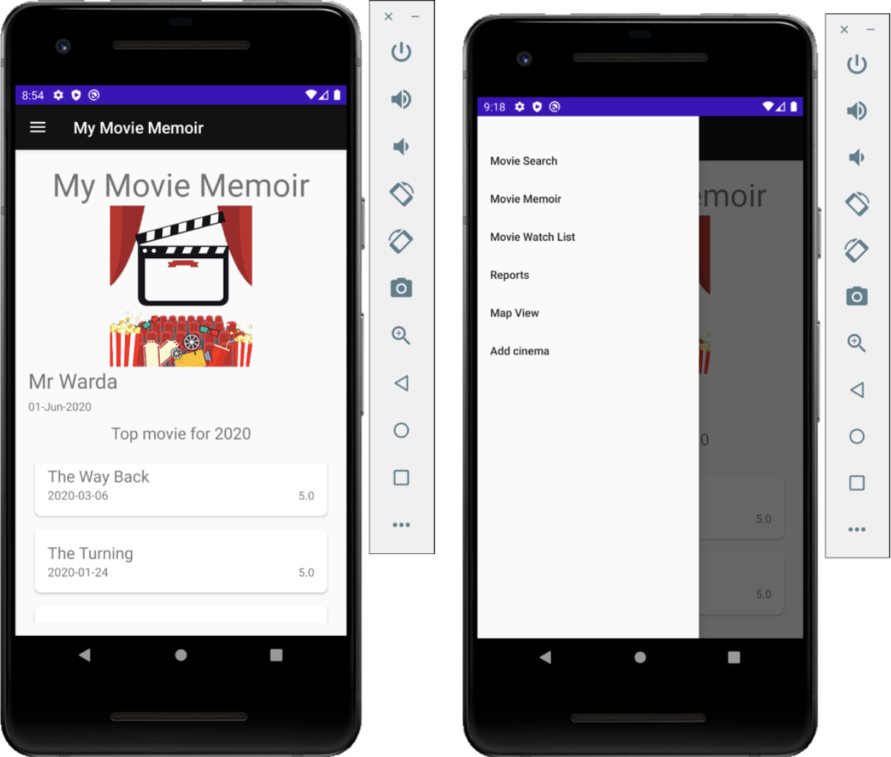
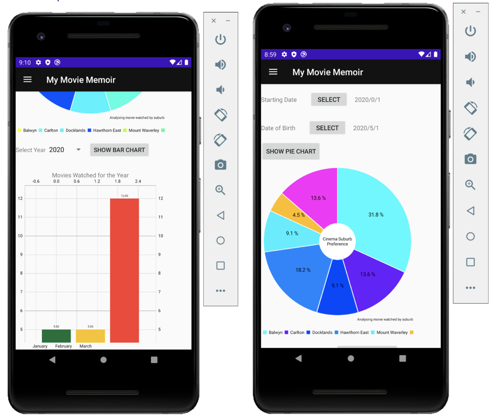

# Android Application Development

This project aim towards building a mobile and distributed, personalized diary application for keeping track of movies you watched and their details. The mobile app will be a movie memoir that allows people to create, delete, add or view a collection of memories that you had about the movies.

## Sample application screen
### 1. Login Screen
> - Checks for existing user, for login
> - Password is sent as an hash

### 2. Sing Up Screen
> - Data validation from the user with error messages

### 3. Home Screen
> Uses fragments and navigation drawer to navigate between other screens

### 4. Movie Search Screen
> Uses Google API to come up with movie search results and relevant information

### 5. Movie View Screen
> Displays information acquiring form different API's

### 6. Add to the Memoir Screen

### 7. User Report Screen

### 8. User Location Screen

